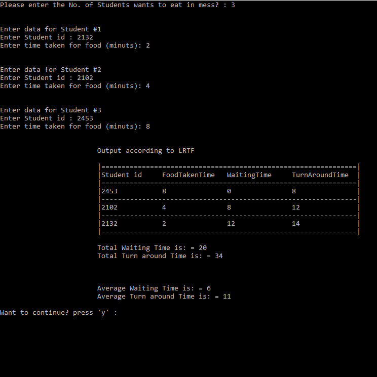
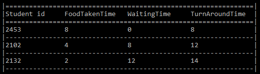

# CPU Scheduling | Longest Remaining Time First (LRTF) algorithm
#### Use case of LRTF
> Three Students (a, b, c) are arriving in the Mess at the same time. The Id numbers of these Students are 2132, 2102, 2453 and the food taken time from the mess table is 2, 4 and 8 minutes. If the two students have same remaining time so it is broken by giving priority to the Students with the lowest id number. Consider the Longest Remaining Time First (LRTF) Scheduling Algorithm and calculate the average turnaround time and waiting time.
#### Solution [C Language](LRTF-Scheduling.c)
##  :beginner:Table of Contents
* [Working Conditions](#working-conditions)
* [Algorithm](#algorithm)
* [Purpose](#purpose)
* [Procedure](#procedure)
* [Gantt Chart](#gantt-chart)
* [General Terms](#general-Terms)
* [Formulas](#formulas)

## Working conditions
* Give the input
* Board should be printed out every time given no of students with their IDs are proceeded.
* Display average turnaround time and waiting time.



## Algorithm
*	**Step-1**: Create a structure of process containing all necessary fields like AT (Arrival Time), BT (Burst Time), CT (Completion Time), TAT (Turn Around Time), WT (Waiting Time). 
*	**Step-2**: Sort according to the AT; 
*	**Step-3**: Find the process having Largest Burst Time and execute for each single unit. Increase the total time by 1 and reduce the Burst Time of that process with 1. 
*	**Step-4**: When any process has 0 BT left, then update the CT (Completion Time of that process CT will be Total Time at that time). 
*	**Step-5**: After calculating the CT for each process, find TAT and WT. 

## Purpose
This is a pre-emptive version of Longest Job First (LJF) scheduling algorithm. In this scheduling algorithm, we find the process with maximum remaining time and then process it. We check for the maximum remaining time after some interval of time (say 1 unit each) to check if another process having more Burst Time arrived up to that time.

## Procedure
-	**Step-1**: First, sort the processes in increasing order of their Arrival Time. 
-	**Step-2**: Choose the process having least arrival time but with most Burst Time. Then process it for 1 unit. Check if any other process arrives up to that time of execution or not. 
-	**Step-3**: Repeat the above both steps until execute all the processes. 
Example: Consider the following table of arrival time and burst time for four processes P1, P2, P3 and P4. 

| Process   | Arrival time  | Burst Time |
| :-------: | :-----------: | :--------: |
| P1        | 1 ms          | 2 ms       |
| P2        | 2 ms          | 4 ms       |
| p3        | 3 ms          | 6 ms       |
| p4        | 4 ms          | 8 ms       |

## Gantt chart


**Output:**
*Total Turn Around Time = 68 ms
So, Average Turn Around Time = 68/4 = 17.00 ms*

*And, Total Waiting Time = 48 ms
So, Average Waiting Time = 12.00 ms* 
#### Reference Code for Theory [Python](LRTF.ipynb)

## General Terms
- **Arrival Time**:Time at which the process arrives in the ready queue.
- **Completion Time**:Time at which process completes its execution.
- **Burst Time**:Time required by a process for CPU execution.
- **Turn Around Time**:Time Difference between completion time and arrival time.          
- **Waiting Time**: Time Difference between turnaround time and burst time.

## Formulas
```
Turn Around Time (TAT) = (Completion Time) - (Arrival Time)
Waiting Time (WT) = (Turn Around Time) - (Burst Time) 
```

---
# :bulb:Extras - Different Scheduling Algorithms
#### Objectives of Process Scheduling Algorithm
###### Max CPU utilization [Keep CPU as busy as possible]
###### Fair allocation of CPU.
###### Max throughput [Number of processes that complete their execution per time unit]
###### Min turnaround time [Time taken by a process to finish execution]
###### Min waiting time [Time a process waits in ready queue]
###### Min response time [Time when a process produces first response]

**First Come First Serve (FCFS):** Simplest scheduling algorithm that schedules according to arrival times of processes. First come first serve scheduling algorithm process that requests the CPU first is allocated the CPU first. It is implemented by using the FIFO queue. When a process enters the ready queue, its PCB is linked onto the tail of the queue. When the CPU is free, it is allocated to the process at the head of the queue. The running process is then removed from the queue. FCFS is a non-preemptive scheduling algorithm.

**Note:** First come first serve suffers from convoy effect.

**Shortest Job First(SJF):** Process which have the shortest burst time are scheduled first.If two processes have the same bust time then FCFS is used to break the tie. It is a non-preemptive scheduling algorithm.

**Longest Job First(LJF):** It is similar to SJF scheduling algorithm. But, in this scheduling algorithm, we give priority to the process having the longest burst time. This is non-preemptive in nature i.e., when any process starts executing, can’t be interrupted before complete execution.

**Shortest Remaining Time First(SRTF):** It is preemptive mode of SJF algorithm in which jobs are schedule according to shortest remaining time.

**Longest Remaining Time First(LRTF):** It is preemptive mode of LJF algorithm in which we give priority to the process having largest burst time remaining.

**Round Robin Scheduling:** Each process is assigned a fixed time(Time Quantum/Time Slice) in cyclic way. It is designed especially for the time-sharing system. The ready queue is treated as a circular queue. The CPU scheduler goes around the ready queue, allocating the CPU to each process for a time interval of up to 1-time quantum. To implement Round Robin scheduling, we keep the ready queue as a FIFO queue o£ processes. New processes are added to the tail of the ready queue. The CPU scheduler picks the first process from the ready queue, sets a timer to interrupt after 1-time quantum, and dispatches the process. One of two things will then happen. The process may have a CPU burst of less than 1-time quantum. In this case, the process itself will release the CPU voluntarily. The scheduler will then proceed to the next process in the ready queue. Otherwise, if the CPU burst of the currently running process is longer than 1-time quantum, the timer will go off and will cause an interrupt to the operating system. A context switch will be executed, and the process will be put at the tail o£ the ready queue. The CPU scheduler will then select the next process in the ready queue.

**Priority Based scheduling (Non-Preemptive):** In this scheduling, processes are scheduled according to their priorities, i.e., highest priority process is scheduled first. If priorities of two processes match, then schedule according to arrival time. Here starvation of process is possible.

**Highest Response Ratio Next (HRRN)** In this scheduling, processes with highest response ratio is scheduled. This algorithm avoids starvation.

`Response Ratio = (Waiting Time + Burst time) / Burst time`

**Multilevel Queue Scheduling:** According to the priority of process, processes are placed in the different queues. Generally high priority process are placed in the top level queue. Only after completion of processes from top level queue, lower level queued processes are scheduled. It can suffer from starvation.

**Multi level Feedback Queue Scheduling:** It allows the process to move in between queues. The idea is to separate processes according to the characteristics of their CPU bursts. If a process uses too much CPU time, it is moved to a lower-priority queue.
